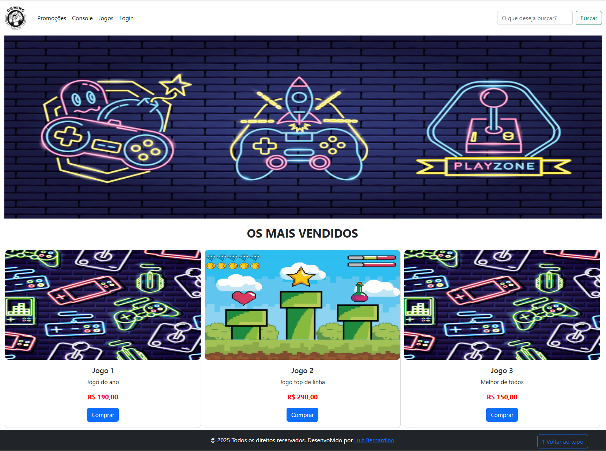

# GameMania-SENAI



**Descrição:**
O projeto GameMania-SENAI é um site para venda de jogos, consoles e acessórios. Desenvolvido como parte do curso de Desenvolvimento Fullstack do SENAI, o site oferece uma experiência de usuário fluida e intuitiva, com funcionalidades que permitem aos usuários navegar, pesquisar e comprar produtos com facilidade.

## Funcionalidades

- **Navegação:** Menu intuitivo com categorias de produtos.
- **Pesquisa:** Barra de busca para encontrar produtos específicos.
- **Login/Cadastro:** Sistema de autenticação de usuários.
- **Carrinho de Compras:** Adição e remoção de produtos no carrinho.
- **Checkout:** Processo de finalização de compra.
- **Responsive Design:** Design responsivo para diferentes dispositivos.

## Tecnologias Utilizadas

- **HTML5:** Estruturação das páginas.
- **CSS3:** Estilização das páginas.
- **Bootstrap 5:** Framework CSS para design responsivo.
- **JavaScript:** Interatividade e funcionalidades dinâmicas.
- **jQuery:** Biblioteca JavaScript para simplificação do código.
- **Git:** Controle de versão.
- **GitHub:** Hospedagem do repositório.

## Estrutura do Projeto

```plaintext
GameMania-SENAI/
├── index.html
├── login.html
├── css/
│   └── estilo.css
├── js/
│   ├── script.js
│   └── jquery-script.js
├── img/
│   └── logo.png
└── README.md
